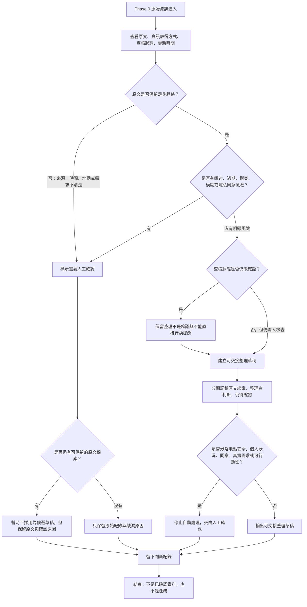

# 資訊流程設計

> 這份文件由 Codex 依 `release-packs/02-flow-design-kit/` 產生草稿。流程合理性仍需要小組用 VS Code 預覽 Mermaid，並由人檢查後修改。

## 我的 v1 目標

- 我優先服務的使用者：資訊整理者。
- 這個使用者最想完成的事：把 Phase 0 原始資訊整理成下一位協作者看得懂的可交接草稿，同時保留原文、整理者判斷與仍待確認的地方。
- 我最想避免的錯誤：讓草稿、AI 提示、完整欄位或紅字標籤被誤讀成已確認事實、可信排名、派工優先序或可以直接行動的依據。

## 自然語言流程描述

```text
Phase 0 原始資訊進入工作台後，資訊整理者先看原文、資訊取得方式、查核狀態與更新時間。
整理者先判斷原文是否保留了足夠脈絡，例如來源、時間、地點、需求、數量、當事人同意或是否為轉述。
如果缺少關鍵脈絡，或內容看起來可能過期、衝突、轉述、模糊，先標示為需要人工確認，不能整理成可行動內容。
如果資訊看起來完整，仍要檢查查核狀態；只要尚未確認，就必須保留「整理不是確認」與「不能直接行動」的提醒。
整理者可以建立可交接整理草稿，但草稿必須分成「原文線索」「整理者判斷」「仍待確認」三段。
AI 或前端規則只能提示原文缺漏與可能誤讀風險，不能判斷真假、可信度排名、派工優先序或是否可以出發。
若資料涉及地點安全、個人狀況、當事人同意、真實需求或可行動性，流程必須停在人工確認，不自動產生候選結果。
若資料暫時不能整理，也要保留原文、原因與下一步確認提醒，不把它丟掉或改寫成乾淨資料。
每次整理者做出判斷、建立草稿、標示需要人工確認、暫時不採用或修正 AI 提示，都要留下判斷紀錄。
最後輸出只能是「可交接整理草稿」或「暫時不採用但保留原因的紀錄」，不是已確認資料，也不是任務。
```

## Mermaid 流程圖

請用 VS Code 預覽，確認流程圖能正常顯示。



## 人工確認點

- 原文是否有足夠脈絡：來源、時間、地點、需求、數量、當事人同意是否清楚。
- 資訊是否只是轉述、截圖、群組訊息、可能過期或與其他資訊衝突。
- 查核狀態仍未確認時，畫面是否已足夠提醒「整理不是確認」與「不能直接行動」。
- 涉及地點安全、個人狀況、同意、真實需求或可行動性時，必須停下來交給人判斷。
- AI 或前端規則提示的缺漏是否真的來自原文，而不是補出原文沒有的內容。

## 不能自動處理的分支

- 不能讓 AI 判斷資訊真假、可信度排名、派工優先序或是否可以出發。
- 不能把 `needs_review`、`unverified` 或其他未確認狀態整理成 confirmed / verified。
- 不能把看起來完整的地點、人數、物資或集合點自動變成任務。
- 不能自動判斷當事人同意、地點安全、需求仍有效或資訊是否過期。
- 不能把暫時不採用的資料丟掉；仍要保留原文與不能處理的理由。

## 操作或判斷紀錄

- 建立、修改或刪除整理草稿時，要記錄整理者做了什麼判斷。
- 標示需要人工確認時，要記錄原因，例如來源不明、時間可能過期、地點模糊、需求不清楚、轉述或同意不明。
- 暫時不採用為候選草稿時，要記錄為什麼不能直接整理，以及下一位協作者應該先確認什麼。
- 採用或修正 AI 提示時，要記錄哪些提示被採用、哪些被拒絕，以及人類判斷理由。

## 我檢查後修正了什麼

- 原本：流程一開始可能會從「整理草稿」開始，容易讓 Codex 後續實作時忽略原始資訊與查核狀態。
- 修正後：流程改成從「Phase 0 原始資訊進入」開始，第一步先查看原文、資訊取得方式、查核狀態與更新時間。
- 為什麼：`docs/design-checklist.md` 要求流程從原始資訊開始，且不能把未確認資訊直接當成已確認。

- 原本：只寫「資訊足夠就建立候選結果」，容易讓看起來完整但未確認的資料被誤認為可以行動。
- 修正後：新增「查核狀態是否仍未確認」與「涉及地點安全、個人狀況、同意、真實需求或可行動性」兩個停下來確認的分支。
- 為什麼：這能對齊 `docs/decisions.md` 的主決策「整理不是確認」，也避免把 AI 或前端規則變成決策者。

## 我仍不確定的流程點

- 「原文缺漏提示」要用哪些固定原因，才不會看起來像可信度分數或排序。
- 「可交接整理草稿」的按鈕文案要怎麼寫，才不會被誤會成正式保存或確認完成。
- 如果行動者看到 v1 畫面，哪一個停止訊號最清楚：醒目標籤、固定警示、還是每筆資料旁的不可行動原因。
- 暫時不採用的資料要如何在畫面上被看見，才不會像被刪除，也不會像已經整理乾淨。
